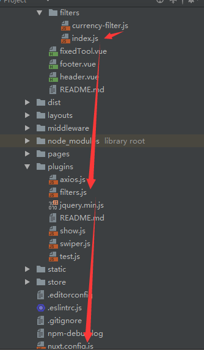
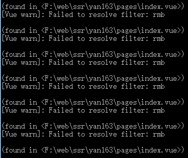
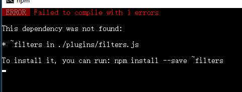

## 1过滤器文件目录展示

---

## 2文件代码展示
###### filter/currency-filter.js
```js
/**
 * 页面价格转换为货币格式过滤器
 */

// 价格前面加上人民币符号
export const rmb = (val, str, hasSymbol) => {
  if (str > 0 && typeof hasSymbol === 'undefined' ) {
    return `¥${val}.00`;
  } else if (str > 0 && !hasSymbol) {
    return `${val}.00`;
  } else {
    return `¥${val}`;
  }
}

```

###### filter/index.js
```js
import { rmb } from './currency-filter';

export default{
  rmb
}
```

###### plugins/filter.js
```js
import Vue from 'vue';
import filters from '~components/filters';

// Vue注册全局过滤器
Object.keys(filters).forEach((key) => {
    return Vue.filter(key, filters[key])
});
// Object.keys(filters).forEach(key => Vue.filter(key, filters[key]))
```

## 3 nuxt引入(nuxt.config.js)filter.js
```js
plugins: [
    { src: '~plugins/filters.js', ssr: false }
]
```

## 4 页面使用过滤器
```html
{{item.price | rmb}}
```
###### 这样使用命令行有警告,但是不影响功能

*****
##### 问题1
问题: filter文件夹现在只能放在
components下,放其他会报错

 
