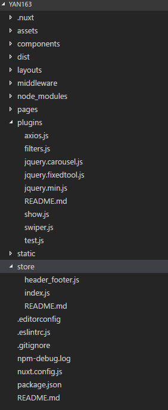

# Vuex状态树
***
## 使用状态树

***
#### 模块方式使用

###### 使用展示1

场景:每页头部和底部相同的数据放到vuex中


1.1 目录结构



1.2 store/header_footer.js
```js
export const state = () => {
  return {
    searchHotKeyList : [],
    tabNav : [],
    footerList : []
  }
}

export const mutations = {
  GET_DATA_sHotKey(state, action) {
    state.searchHotKeyList = action.searchHotKeyList
  },
  GET_DATA_tabNav(state, action) {
    state.tabNav = action.tabNav;
  },
  GET_DATA_footerList(state, action) {
    state.footerList = action.footerList;
  }
}

```
模块方式使用直接导出state 和 mutations就可以了

1.3 store/index.js
```js
import Vue from 'vue'
import Vuex from 'vuex'
import axios from '~plugins/axios'

// Vue.use(Vuex)
//
// const store = () => {
//   return new Vuex.Store({
//     state: {
//       counter: 1
//     },
//     mutations: {
//       increment (state) {
//         state.counter++
//       }
//     }
//   })
// }
//
// export default store

export const actions = {
  // nuxt初始化后执行的第一个方法:
  可以用来配置全局服务初始化
  nuxtServerInit(store, {params}) {
    const initAppData = [
      store.dispatch('loadCommonData') // <--
    ]
    return Promise.all(initAppData)
  },

  loadCommonData({ commit }) {
    return axios.get('/api/common.json')
      .then((res) => {
        commit('header_footer/GET_DATA_sHotKey', { // <--
          searchHotKeyList: res.data.result.SearchWordsList
        })
        commit('header_footer/GET_DATA_tabNav', { // <--
          tabNav: res.data.result.navList
        })
        commit('header_footer/GET_DATA_footerList', { // <--
          footerList: res.data.result.footerList
        })
      })
      .catch((err) => {
        console.log(err)
      })
  }
}

```
1.4 页面使用
```js
import { mapState } from 'vuex'

export default {
    computed: {
      ...mapState([
          'counter'
      ])
    },
    async asyncData({ store }) {
      let data = {};
      try {
        data.commonData = await axios.get('/api/common.json');
        data.indexData = await axios.get('/api/index.json');
      } catch (err) {
        console.log(err);
      }
      return {
        searchHotKeyList: store.state.header_footer.searchHotKeyList,
        tabNav: store.state.header_footer.tabNav,
        footerList: store.state.header_footer.footerList,
      }
    }
}
```
***